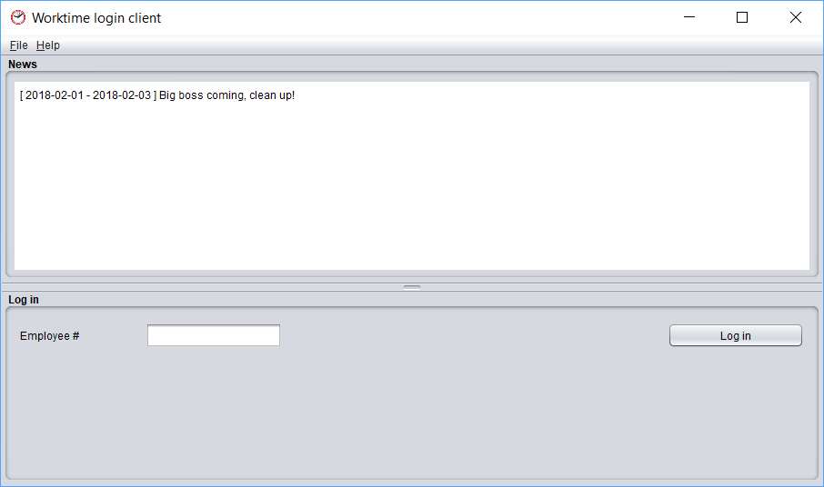
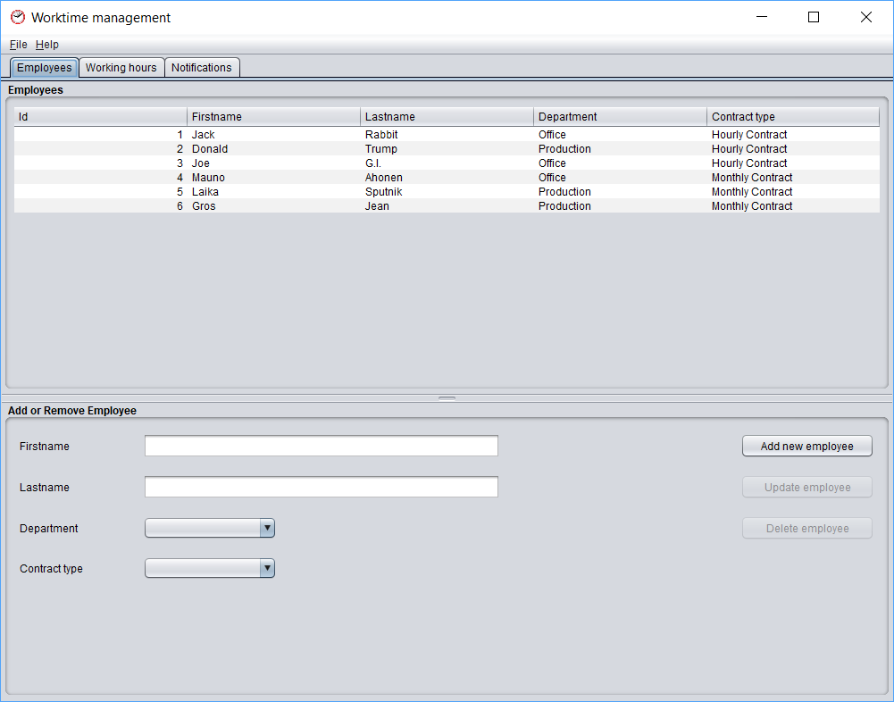
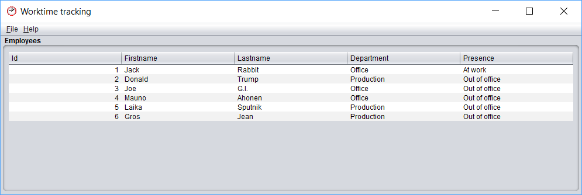

# worktime

**Archived legacy project. No active development.**

Timecard application for tracking employee worktime.

The project includes three standalone Java applications:

## worktime-client
Client app for timecard entries (login, logout, break) and showing notifications.

## worktime-management
Management app for managing employees, calculate & print working hours, and create notifications.

## worktime-tracking
Live tracking of employee's presence (logged in/out).

# Requirements
- JDK7 or later
- SQL Database (tested on MySQL 5.1.34)

# Usage
Installation:
- Install database and JDBC drivers.
- Create workime database with [create_database.sql](src/main/resources/create_database.sql). 
- Optionally, add test data with [create_test_data.sql](src/test/resources/create_test_data.sql). 
- Configure database settings in [persistence.xml](worktime-common/src/main/resources/META-INF/persistence.xml).

Build:
- Build whole project: `mvn clean install`

Execute:
- Execute selected module with: `mvn exec:java`
- Alternatively execute the compiled `worktime-{client|management|tracking}-x.x.x.jar` from `/target` folder.

# Known issues
- No employee authentication implemented.